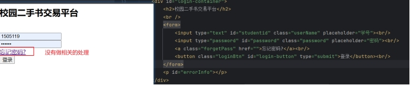
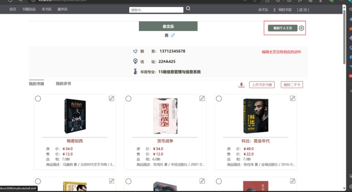
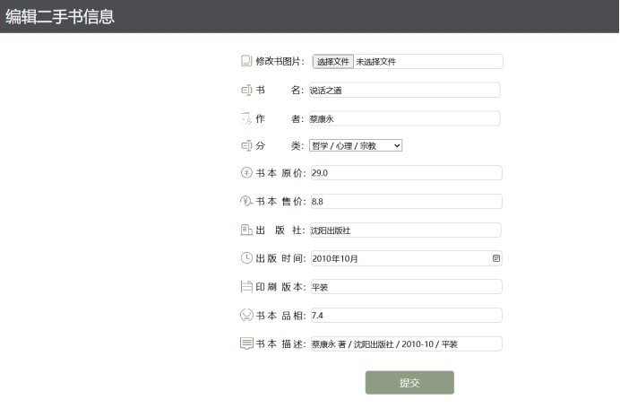

# 基于SSM的二手书交易系统

这是一个功能简单，使用Spring + Spring MVC + Mybatis搭建的二手书交易系统，我是基于[DanielLin07/bookshop: :book: 基于 SSM 框架的二手书交易系统 (github.com)](https://github.com/DanielLin07/bookshop)这个项目进行更改。原始项目比较久远了一些依赖过时了，我更新了相关依赖。

原始项目的错误存在的错误，即我的修改。

login.jsp中

建了一个forgetPassword 

用来跳转到一个新的页面,在重置按钮中加了一个ajax进行操作,然后跳转到控制中的处理进行数据的更新.

注册页面缺少。完成。通过添加一个页面和相关控制处理、数据库语句。完成操作。

搜索有问题 home.jsp 已解决，通过对searchBook.do	进行修改，在对前端的显示jsp也进行了修改，保证输出的结果是一张图片+数据的形式。

在搜索页面里面搜索没有结果+搜索页面显示个人名字有问题。 已解决。把原始的前端显示修改成一个在对象中读取。

个人信息无法编辑

已解决 ，通过添加了控制处理+页面完成

 

无法编辑图书  原作者的jsp代码有一些问题。对ajax进部分修改

 

二手书籍上传不成功。  不知道为什么又可以操作成功

求书上传失败 修改了控制的处理

 

 

## 快速上手

### 1. 运行环境

  - IDE：IntelliJ IDEA
  - 项目构建工具：Maven
  - 数据库：MySQL
  - Tomcat：Tomcat 8.0.47

### 2. 初始化项目

  - 创建一个名为bookshop的数据库，将bookshop.sql导入
  - 打开IntelliJ IDEA，将项目导入
  - 修改jdbc.properties文件配置，同时配置Tomcat
  - 开始运行，访问http://localhost:8080/home.do

## 实现功能

  - 登录
  - 上传二手图书
  - 编辑二手图手
  - 图书分页展示

## 页面展示

<table>
    <tr>
        <td></td>
        <td></td>
    </tr>
    <tr>
        <td></td>
        <td></td>
    </tr>
    <tr>
        <td></td>
        <td></td>
    </tr>
</table>
